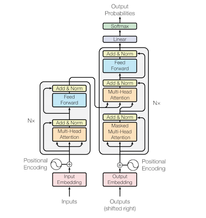

# Attention is All You Need: Attention and the Original Transformer

This is the implementation of the original transformer model in the paper:  <br> &nbsp;&nbsp;&nbsp;&nbsp;
Vaswani et al. ["Attention is All You Need"](https://arxiv.org/pdf/1706.03762.pdf) 2017. 



Image source: Vaswani et al. (2017)

(*) Note: This implementation draws heavily from the "Annotated Transformer" [here](https://nlp.seas.harvard.edu/2018/04/03/attention.html).

## Contents

- [Jupyter Notebook](#Notebook)
- [Example Usage](#Usage)
- [Background](#Background)
- [Transformer](#Transformer)
- [Features](#Features)
- [References](#References)
- [Citation](#Citation)
- [License](#License)

## Notebook

Check out the Jupyter notebook [here](transformer.ipynb) to run the code.


## Usage

Transform a corpus and train the model is a few lines of code:

```python

args = Namespace(
    # Model hyper-parameters
    num_layers_per_stack = 2, #original value = 6
    dim_model = 512,
    dim_ffn = 2048,
    num_heads = 8,
    max_sequence_length = 20,
    dropout = 0.1,
    # Label smoothing loss function hyper-parameters
    label_smoothing = 0.1,
    # Training hyper-parameters
    num_epochs=15,
    learning_rate=0.0,
    batch_size = 128,
)

train_dataloader, vocab_source, vocab_target = transformer_dataset.TransformerDataset.get_training_dataloader(args)
vocab_source_size = len(vocab_source)
vocab_target_size = len(vocab_target)
model = transformer.Transformer(vocab_source_size, vocab_target_size,
                                args.num_layers_per_stack, args.dim_model,
                                args.dim_ffn, args.num_heads, args.max_sequence_length,
                                args.dropout)
trainer = train.TransformerTrainer(args, vocab_target_size, vocab_target.mask_index, model, train_dataloader)

trainer.run()
```

## Background

### The predecessor to Transformer: RNN


Prior to the Transformer, the dominant architecture found in sequence models was the
recurrent network (i.e. RNN). While the convolutional network shares parameters across space,
the recurrent model shares parameters across the time dimension (left to right in a sequence). At each time step,
a new hidden state is computed using the previous hidden state and the current sequence value. These hidden states 
serve the function of "memory" within the model. The model hopes to encode useful enough information into these
states such that it can derive contextual relationships between a given word and any previous words in a sequence.

These RNN cells form the basis of an "encoder-decoder" architecture. The goal of the encoder-decoder is to take a source sequence
and predict a target sequence (sequence-to-sequence or seq2seq). A common example of a seq2seq task is machine translation of one language to another. 
An encoder maps the source sequence into a hidden state that is then passed to a decoder. The decoder then attempts to predict the next word in a target sequence using the encoder's hidden state(s) and
the prior decoder hidden state(s).

2 different challenges confront the RNN class of models. 

### RNN and learning complex context

First, there is a challenge of specifying an RNN architecture capable of learning enough context to aid in 
predicting longer and more complex sequences. This has been an area of continual innovation. The first breakthrough was to 
swap out the "vanilla" (i.e. Elmann) RNN cells with the gated RNN networks such as the GRU and LTSM. These RNN cells
have the ability to learn short-term context as well as long-term context between words given their ability to control
how quickly the hidden states are updated to remember "older" (i.e. further back in the sequence) versus "newer"
information. This helps overcome the "vanishing gradient" problem, where the model's ability to update deeper (read: earlier) 
weights in the model is hindered by the fact that weight changes back-propogating during an update would diminish to 0.

While these models outperform vanilla RNNs, through BLEU (language translation) benchmarks it was demonstrated that
that model accuracy would decay as target sequences would increase in length. 
This led to the development of the "attention" mechanism. The insight was to add "attention" between the encoder and decoder blocks (called "encoder-decoder attention"). 
The attention mechanism would not just pass the final hidden state from the encoder, but instead all of the hidden states derived in the encoder stack.
Then for each time step in the decoder block, a "context" state would be derived as a function of these hidden states where the 
decoder could determine which words (via their hidden state) to "pay attention to" in the source sequence in order to predict 
the next word. This breakthrough was shown to extend the prediction power of RNNs in longer sequences. 

### Sequential computation difficult to parallelize

Second, due to the sequential nature of how RNNs are computed, RNNs can be slow to train at scale (for a different perspective,
see Andrej Kaparthy's blog post on RNNs [here](http://karpathy.github.io/2015/05/21/rnn-effectiveness/)).

## Transformer

The authors' critical insight to overcoming these challenges was that the sequential computation behind RNNs
was not necessary to capture intra-word context within sequence-sequence models. 
Their realization was that "attention is all you need". Instead of processing 
words left to right in a sequence, "self-attention" could be leveraged to encode the relative importance of words in a sequence
that is processed in its entirety. 

The Transformer model is also an encoder-decoder architecture, but with a different series of layers (and sub-layers) worth noting.

I touch upon some of them below.

### Positional Encoding

tbd. Probs a sinusoidal plot (from test).

### Attention (Self and Encoder-Decoder Attention)

tbd. Probs some key,value, query graphs + attention plots (see notebook).

### Label Smoothing

tbd. Probs a plot showing 2 distributions + mention recent Google Research paper.

### Noam Optimization

tbd. Probs a LR plot (from test).

### Overall

The Transformer model have set the record on a number of translation benchmarks. It has also spawned a number of research efforts 
into other transformer-based architectures by multiple research groups, among them BERT (encoder-only Transformer),
GPT (decoder-only Transformer), as well as ELMO, XLNET, and other *BERTs (lots of Sesame Street). Further, 
a large amount of effort has been poured into different attention mechanism (for instance, sparsity-based attention).

### Code

You can find the implementation [here](../../../transformer.py) with detailed comments. This model has a number of details
that I did not cover that are worth reviewing.

## Features

- [ ] Self-contained "library" of Transformer model re-implementation, tokenizer, 
dictionary, data loader, and re-producible notebook example
- [ ] Implementations of: Dot-product attention; positional encoding; encoder-decoder architecture.
- [ ] Implementation of Noam Optimizer ( in `nlpmodels/utils/optims`)
- [ ] Implementation of Label Smoothing loss function (in `nlpmodels/utils/label_smoother`)
- [ ] Torchtext dataset usage


## References

These implementations were helpful when I was working through some nuances:
1. https://nlp.seas.harvard.edu/2018/04/03/attention.html (Harvard's NLP group. This was extremely helpful and I leveraged it a significant amount).
2. https://pytorch.org/tutorials/beginner/transformer_tutorial.html (Pytorch has its own transformer class).
3. https://www.tensorflow.org/tutorials/text/transformer (Transformer tutorial found on Tensorflow website).
4. https://github.com/tensorflow/tensor2tensor/blob/master/tensor2tensor/models/transformer.py (Original code in Tensorflow).

In terms of explaining the intuition of the model, I thought these were well-written:
1. Original paper (link found above)
2. https://lilianweng.github.io/lil-log/2018/06/24/attention-attention.html (Lilian Weng's overview of the Transformer is very thorough and worth a read).
3. http://jalammar.github.io/illustrated-transformer/( nice visualizations)


## Citation

```python
@misc{Attention is All You Need: Attention and the Original Transformer,
  author = {Thompson, Will},
  url = {https://github.com/will-thompson-k/deeplearning-nlp-models},
  year = {2020}
}
```
## License

MIT
