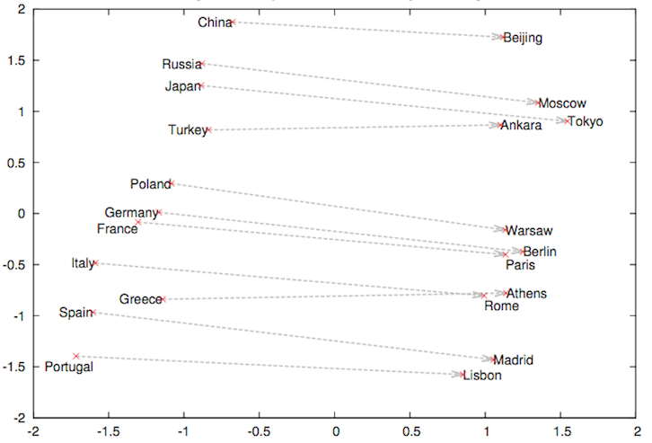
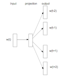
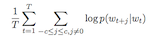

# Word2vec: Skip-gram via Negative Sampling

This is the implementation of the Skip-gram model in the paper:  <br> &nbsp;&nbsp;&nbsp;&nbsp;
Mikolov et al. ["Distributed Representations of Words and Phrases
    and their Compositionality"](https://papers.nips.cc/paper/5021-distributed-representations-of-words-and-phrases-and-their-compositionality.pdf) 2013. 



Image source: Mikolov et al. (2013)

## Contents

- [Jupyter Notebook](#Notebook)
- [Code](#Code)
- [Example Usage](#Usage)
- [Motivation of Using Embeddings](#Background)
- [Applications in Transfer Learning](#Transfer_Learning)
- [Skip-gram](#Skip-gram)
    * [Negative Sampling](#Negative_Sampling)
- [Features](#Features)
- [References](#References)
- [Citation](#Citation)
- [License](#License)

## Notebook

Check out the Jupyter notebook [here](word2vec.ipynb) to run the code.

## Code

You can find the implementation [here](../../../models/word2vec.py) with comments.

## Usage

Transform a corpus and train the model is a few lines of code:

```python
args = Namespace(
    # skip gram data hyper-parameters
    context_window_size = 5, # window around target word for defining context
    subsample_t = 10.e-15, # param for sub-sampling frequent words
    # Model hyper-parameters
    embedding_size = 300, # size of embeddings
    negative_sample_size= 20, # k examples to be used in negative sampling loss function
    # Training hyper-parameters
    num_epochs=100,
    learning_rate=0.0001,
    batch_size = 4096,
)


train_dataloader, vocab = SkipGramDataset.get_training_dataloader(args.context_window_size,
                                                                args.subsample_t,
                                                                args.batch_size)
word_frequencies = torch.from_numpy(vocab.get_word_frequencies())
model = word2vec.SkipGramNSModel(len(vocab), args.embedding_size, args.negative_sample_size,word_frequencies)
trainer = train.Word2VecTrainer(args,model,train_dataloader)
trainer.run()
embeddings = model.get_embeddings()
```

## Background

A traditional **bag-of-words** (i.e. "BOW") approach extracts heuristic-defined features from a given text.
These are often **frequency-based**, where the frequency of a term is thought to be proportional to its signal.
We know this hypothesis isn't totally accurate - for instance, the word "the" may appear very frequently, but
lack any meaningful value- so massaging through pre-processing and/or frequency transformations is usually required 
to tweak terms. These independent features usually either used as input to downstream feature transforms or are directly combined to developer a 
stronger composite prediction about some target.

Suppose that we were interested in boosting our model's signal by gaining contextual understanding of the words in a text.
This is the premise of the **"distributional hypothesis"**, that words that are close in proximity in a sentence share meaning. 
Word embeddings present a representation that gets closer to semantic meaning versus a purely frequency-based approach.

While there are many popular embeddings, word2vec is one of the most popular class of embedding models. Many NLP packages 
contain embeddings derived from different data sources using different methods.

## Transfer_Learning

Embeddings are one of the most frequent forms of **"transfer learning"** found in NLP. Taking some set of documents (preferably very,very large), 
word embeddings are trained to express the context of words found together within this corpus in a lower dimensional encoding 
(lower with respect to the vocabulary, which can be on the order of ~10-100k's). While it is usually hard to interpret the 
meaning of these latent variables, they can be "transferred" to many other downstream NLP tasks (usually with fewer data points). 

For example, embeddings can be used as numerical representations of tokens in classic ML NLP models to make inferences. 
Researchers are looking at best practices for transferring embeddings trained on one corpus and applying them to other problems
 (such as this paper [here](https://arxiv.org/abs/1702.01417), where they de-mean
the word embeddings and find it boosts the transferability).

Of course, embeddings can also be used as token representations in DL models as well. More often then not, embeddings are used
to represent tokens in one of the first layers of a DL architecture and serve as inputs to subsequent layers.


## Skip-gram

With the word2vec style of embedding problem, there are 2 arguments: an input/target word and a 
collection of surrounding words (i.e "context").

One style of word2vec tries to map multiple the context to a given target. This is called **"CBOW"**, or continuous bag of words. 
The other style, **"skip-gram"** attempts to take an input word and map it to a context. This implementation is
concerned with the latter.



Image source: Mikolov et al. (2013)


### Negative_Sampling

The canonical skip-gram problem is here:

  
Image source: Mikolov et al. (2013)


where each of those probabilities are calculated by a softmax probability calculation.  

Note that there are actually 2 sets of embeddings being trained in a word2vec problem: input embeddings and output embeddings.
While most applications are concerned with the input embeddings, output (context) embeddings have interesting potential applications
with topic modeling.  

The softmax approach suffers from being *extremely* slow as the denominator needs to be calculated for each word
in the vocabulary.

This paper made a pretty incredible insight into how to get around this computational hurdle. Instead of
framing the problem as a multi-class classification problem, it treats the problem as a binary classification
problem where `y:=1` means the 2 words are in the same context window and `y:=0` means they are not. This type of target
is similar to that found in the metric learning and "few shot learner" (FSL) family of problems where the model is learning
a representation such that the words within the same context are within a close distance. To accomplish this distance learning,
there are k random negative samples drawn for every positive (input,context) example to train the model how to differentiate the 2 cases.
Thus, instead of a large multi-class problem we've reduced it into a **k+1** set of **binary classification** problems.

  
Image source: Mikolov et al. (2013)


This paper made another suggestion on how to reduce computation time further via sub-sampling frequent words. The intuition behind
this idea is quite simple: for words that frequently appear within the corpus there are diminishing returns to samples that contain
the word. This empirically can significantly speed up the amount of time to fit the model.

## Features

- [ ] Self-contained "library" of word2vec model re-implementation, tokenizer, 
dictionary, data loader, and re-producible notebook example
- [ ] Implementation of frequent word sub-sampling ( in `nlpmodels/utils/skipgram_dataset`)
- [ ] Implementation of negative sampling  (in `nlpmodels/models/word2vec` )
- [ ] Huggingfaces dataset usage

## References

For more in-depth explanations of embeddings and word2vec, I recommend reading the following:
1. The original paper (linked above)
2. https://kelvinniu.com/posts/word2vec-and-negative-sampling/ (skip-grams clearly explained)
3. https://colah.github.io/posts/2014-07-NLP-RNNs-Representations/ (really well-written treatment by Chris Colah)

These implementations were helpful when I was working through some nuances:
1. https://github.com/Andras7/word2vec-pytorch
2. https://github.com/theeluwin/pytorch-sgns

## Citation

```python
@misc{Word2vec: Skip-gram Implementation,
  author = {Thompson, Will},
  url = {https://github.com/will-thompson-k/deeplearning-nlp-models},
  year = {2020}
}
```
## License

MIT


